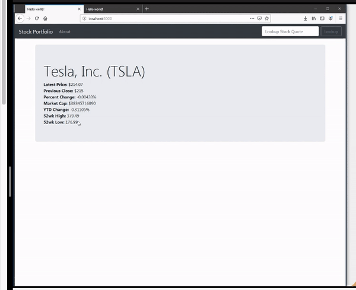

# Stock Market Lookup App

## In this course we are going to build a stock market app using node.

### we are going to be able to type in a stock ticker symbol, click the button, and get the information :
 basic stock market information
 current price
 previous close
 percent change
 market cap 
 YTD change
 52 Week High
 52 Wk low  

 

 SORT OF IRRELEVANT

 we're mostly interested in how to connect to any API. 

 we just chose the stock market API because it was interesting  to me

connect to just about any API i want:
 grab data from it, pull it into my app, format it ,do some stuff to it, and then display it onto the screen.

 basic web development
 how to connect and use third-party API's
 

 

 # Tools needed 

### text editor [(Visual Studio Code)](https://code.visualstudio.com/)  
### terminal  
### [node.js](https://nodejs.org/en/)

 

We need to create a package.json file. 
A configuration file which allows us to keep track of different things in our project.

node package manager
within directory of the .js file run `npm init -y` code in the terminal to automatically generate a package.json file that we need to track any changes within our project.

node package manager express 
`npm install express`
https://expressjs.com/

